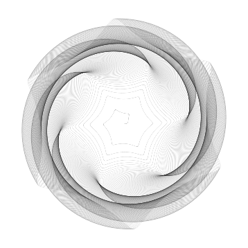
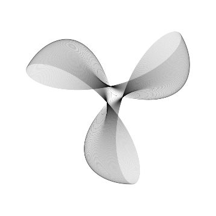

Spirograph
============

Introduction
------------

This small openFrameworks program allows you to make spirograph figures. 

More information about spirograph and this program <a href="https://elaye.github.io/openframeworks/2015/03/12/spirograph.html" target="_blank">here</a>.

Installation
------------

Copy the `spirograph` folder into your `openFrameworks/apps/myApps` folder.
Compile and run.

Usage
-----

The limit parameter indicates the number of tours that the wheel does.

Examples
--------

	

	

More examples <a href="https://elaye.github.io/openframeworks/2015/03/12/spirograph.html" target="_blank">here</a>.

Dependencies
------------
ofxGui

Compatibility
------------
This addon works with oF 0.8.3.
It was tested with linux and oF 0.8.3. 